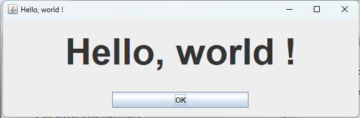

# Starting with Ascii Art Grid Bag Layout in Java

We will make a small class that displays Hello World :

When OK is pressed, the application stops.

Now let's see how to make this small Application/Class using `AsciiArdGridBagLayout`.

The first thing to do is to draw an Ascii Art drawing of how your window will look like.

Inside each rectangle, a name must be given to identify the rectangle.
Usually a letter is sufficient (If you want the full format description
it is in the [layout definition doc](layout-definition.md) ).

Here is our simple layout drawing :

~~~~
+--------------------------------------------+
|                                            |
|                     L                      |
|                                            |
+--------------+--------------+--------------+
|              |              |              |
|              |<     B      >|              |
|              |              |              |
+--------------+--------------+--------------+
~~~~

Let's start by specifying the package, and importing the necessary classes.
Then we start the class declaration. Our class inherits from JFrame.

~~~~ java

package org.hkmi2.aagbl.tests;

import java.awt.Font;
import java.awt.event.ActionEvent;
import java.awt.event.ActionListener;

import javax.swing.JButton;
import javax.swing.JFrame;
import javax.swing.JLabel;

import org.hkmi2.aagbl.AsciiArtGridBagLayout;
import org.hkmi2.aagbl.LayoutParseException;

/**
 * Simple demo, Hello World style.
 * This class is a JFrame with an ASCII art layout.
 */
@SuppressWarnings("serial")
public class HelloWorld 
  extends JFrame
{
~~~~

Now let's declare our ASCII art drawing for the layout as a simple String (field aa).

~~~~ java
  String aa =
      "+--------------------------------------------+\n"+
      "|                                            |\n"+
      "|                     L                      |\n"+
      "|                                            |\n"+
      "+--------------+--------------+--------------+\n"+
      "|              |              |              |\n"+
      "|              |<     B      >|              |\n"+
      "|              |              |              |\n"+
      "+--------------+--------------+--------------+\n";
~~~~
  
We declare the other fields :

- The layout
- The components

~~~~ java
  AsciiArtGridBagLayout aagbl;
  JLabel L = new JLabel("Hello, world !");
  JButton B = new JButton("OK");
  
~~~~

The constructor of the class initializes things

~~~~ java
  /**
   * Constructor
   * @throws LayoutParseException If there is an error in the layout
   */
  public HelloWorld() 
      throws LayoutParseException 
  {
    super("Hello, world !");
    //say we want to exit on close
    setDefaultCloseOperation(EXIT_ON_CLOSE);
~~~~

Now the important part :

- The layout Object is created, from the ASCII art drawing
- Each component is associated to the corresponding rectangle via the `setConstraints` method. It helps a lot
  to give the same name to the field that contains the component  and to the rectangle that gives the constraints.

~~~~ java

    //create our layout
    aagbl = new AsciiArtGridBagLayout(aa);
    //associate the constraint rectangles with our components
    aagbl.setConstraints("B", B);
    aagbl.setConstraints("L", L);
~~~~

The Layout is now ready, we can set it as the layout of this frame

~~~~ java   
    //now set this as our layout
    setLayout(aagbl);
~~~~

Now each component can be added; we use a method of `AsciiArtGridBagLayout`  that does it in one call :

~~~~ java    
    //and add all the components
    aagbl.addAllComponentsTo(getContentPane());
~~~~

We add the handler that closes the frame when OK is pressed

~~~~ java
    B.addActionListener(new ActionListener() {
      @Override
      public void actionPerformed(ActionEvent e) { dispose(); }
    });
~~~~

Finally we add some code to make the message appear nicer

~~~~ java
    //put a larger and bold font to see our message better
    Font labelFont = L.getFont();
    labelFont = labelFont.deriveFont(60f);
    labelFont = labelFont.deriveFont(Font.BOLD);
    L.setFont(labelFont);
  }
~~~~

Here is the main method that instanciates a HelloWorld object, sets its size, and displays it.

~~~~ java
  
  /**
   * Main application entry point
   * @param args Not used
   * @throws Exception If something goes wrong
   */
  public static void main(String[] args) 
      throws Exception 
  {
    HelloWorld frm = new HelloWorld();
    frm.setSize(600, 200);
    frm.setVisible(true);
  }

}

~~~~

If you don't want to call setConstraints repeatedly, you can first build a map of all the components,
and then use the method setConstraints that takes a map argument.
In our class, this would be :

~~~~ java
    aagbl.setConstraints(AsciiArtGridBagLayout.makeMap(new Object[] {"B",B,"L",L}));
~~~~

